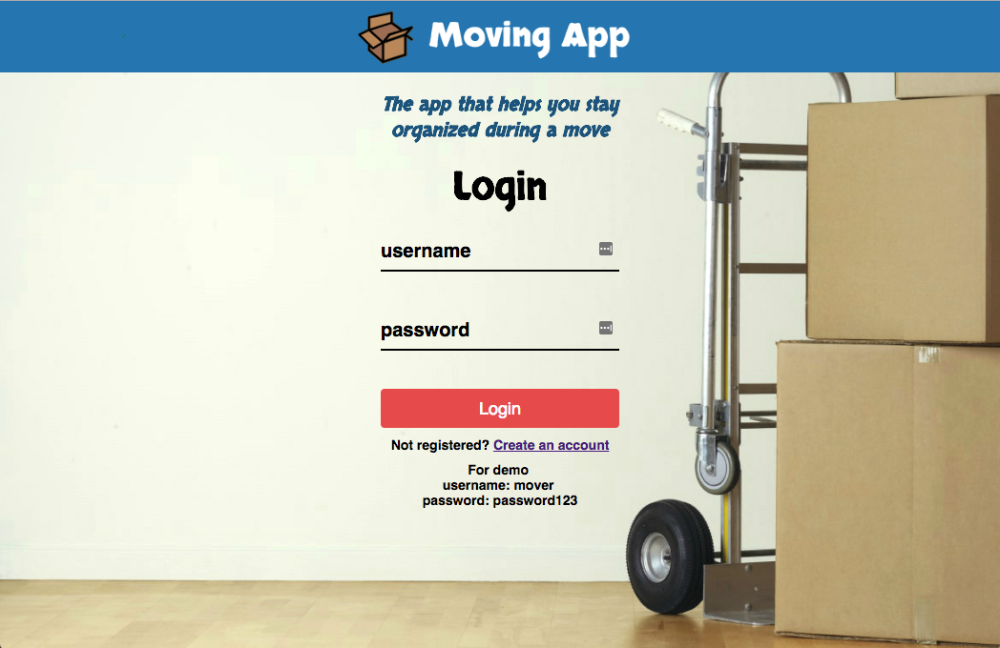
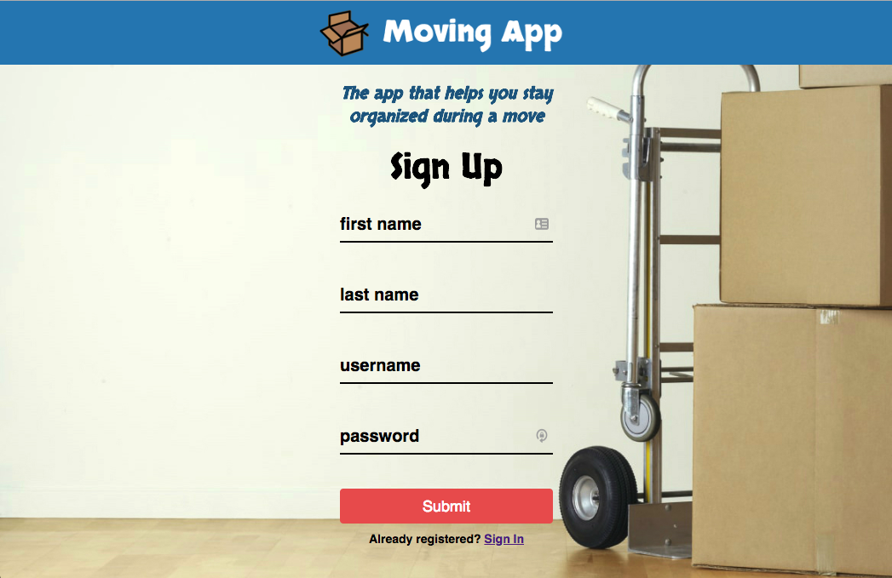
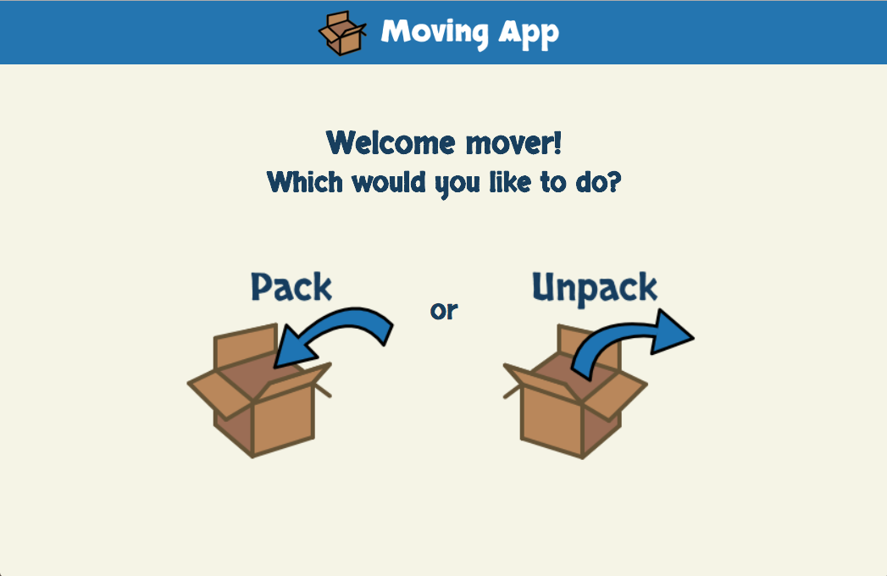
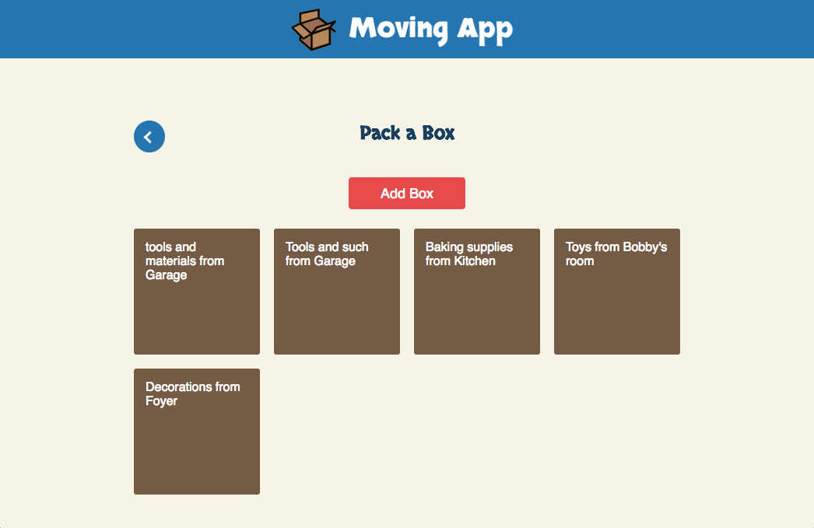
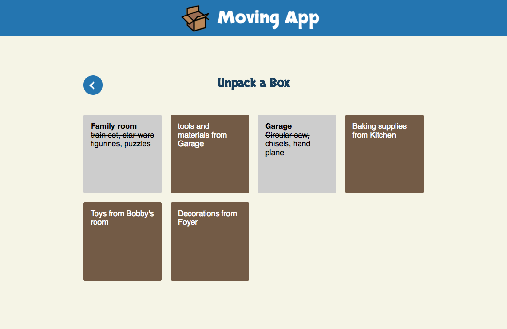
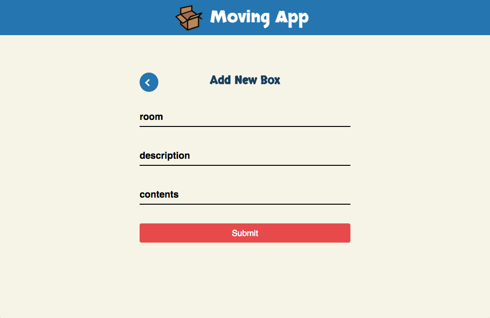
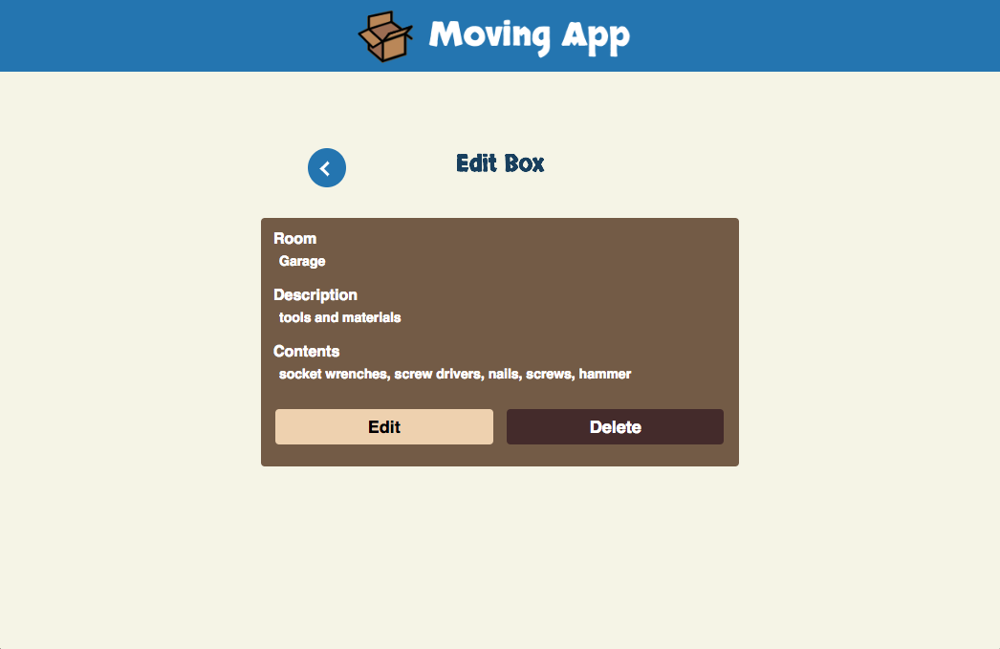
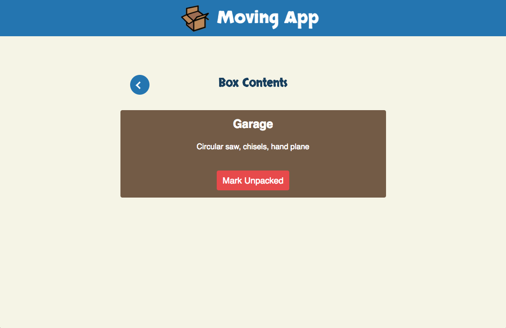

# Moving App

Thinkful capstone project. A fullstack javascript application that helps users stay organized during a move. Users can register an account and begin packing their personal items into boxes. When they are ready to unpack, users can reference each box for the items they contain and begin the unpacking process, marking boxes unpacked as they go. Supports basic CRUD operations. Users can: 

* Create - Add boxes with information for room, description and contents
* Read - Get a list of all boxes 
* Update - Update the room, description, status and/or contents of a box
* Delete - Delete boxes

## Demo

- [Live Demo](https://salty-stream-42324.herokuapp.com/)

## Motivation

With a plan to move in the near future, I was looking for an easy way to keep a log of all my personal items so to maintain a level of organization as well as have the ability to reference the location of items prior to unpacking. 

## Built With

### Front End
* HTML
* CSS
* JavaScript [ES6]
* jQuery

### Back End
* Node.js
* Express
* Mongo
* Mongoose
* JWT Authentication
* bcryptjs
* Passport
* Mocha
* Chai

### DevOps
* Heroku
* TravisCI
* mLab

## Using the API

### Authentication / Login
##### POST &nbsp;&nbsp;&nbsp;&nbsp;&nbsp;&nbsp; /api/auth/login

* Bearer Authentication with JSON Web Token
* Must supply valid Username and Password in request header
* If authentication succeeds, a valid 7d expiry JWT will be provided in response body

### Register New User
##### POST &nbsp;&nbsp;&nbsp;&nbsp;&nbsp;&nbsp; /api/users 

* Must supply First name, Last name, Username and Password in request body
* If successful, a valid 7d expiry JWT will be provided in response body

### Get All Boxes
##### GET &nbsp;&nbsp;&nbsp;&nbsp;&nbsp;&nbsp; /api/boxes/{USER-GOES-HERE}

* This endpoint retrieves all boxes from user database
* Must supply valid JWT via Bearer Authentication
* If authentication succeeds, all User boxes will be returned

### Add Box
##### POST &nbsp;&nbsp;&nbsp;&nbsp;&nbsp;&nbsp;/api/boxes

* This endpoint adds a single box to user database
* Supply box object in request body
* Must supply valid JWT via Bearer Authentication

### Update Box
##### PUT &nbsp;&nbsp;&nbsp;&nbsp;&nbsp;&nbsp;/api/boxes/{BOX-ID-GOES-HERE}

* This endpoint updates a single box in user database
* Supply box ID as route parameter
* Supply box object in request body
* Must supply valid JWT via Bearer Authentication

### Delete Box
##### DELETE &nbsp;&nbsp;&nbsp;&nbsp;&nbsp;&nbsp;/api/boxes/{BOX-ID-GOES-HERE}

* This endpoint deletes a single box from user database
* Supply box ID as route parameter
* Must supply valid JWT via Bearer Authentication

## Screenshots

Landing Page:

Registration Page:

Main Menu:

Packing Page:

Unpacking Page:

Add Box Page:

Edit Box Page:

Box Contents:

